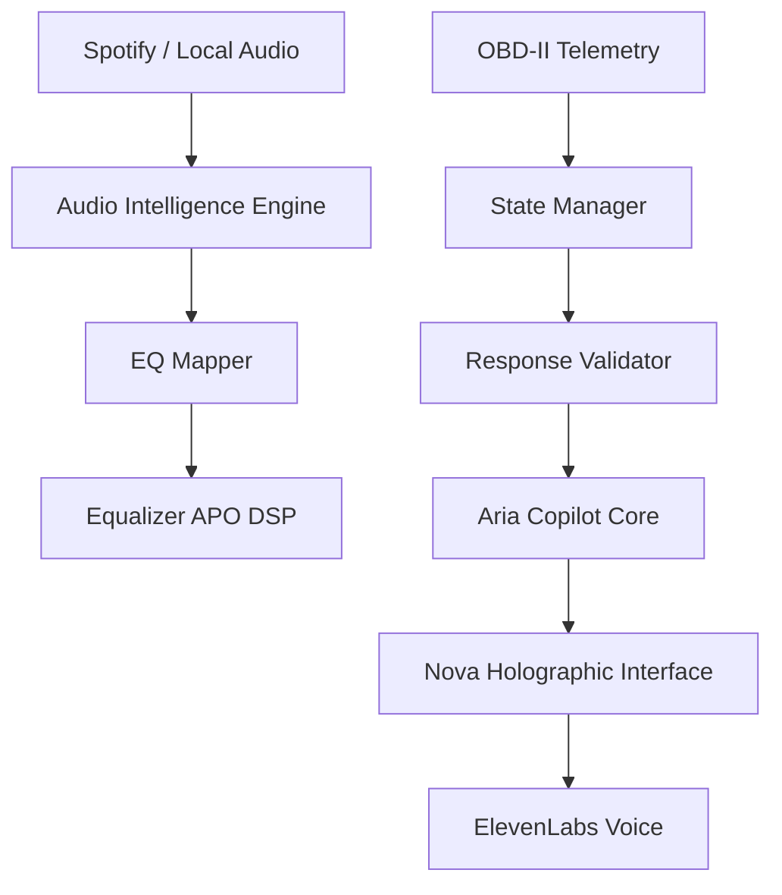

# 🚗 Project ARIA — GTI AI Copilot (Nova Edition)

> **Version:** 0.8.0 (Nova Persona Routing Update)  
> **Status:** Private Development — Public Release Planned Q2 2026  

**The dual-soul AI copilot for your VW GTI MK6**  
Combining holographic personality, real-time car data, and intelligent audio.  

> *"Aria drives with reason. Nova listens with emotion."* 🌌  

---

### 🔗 Quick Links
[🎛 Audio Intelligence](#-audio-intelligence-auto-eq) • [🚗 Driving Contract](#-driving-contract) • [🧠 ML Classifier](#-ml-genre-classifier-gtzan-trained) • [🧰 Setup](#-setup) • [🌌 Personalities](#-personalities)

---

## ⚙️ Features

- 🌌 **Dual Personalities:** Nova (holographic empath) & Aria (driver copilot)  
- 🎯 **Per-Turn Persona Routing:** Address "Nova, ..." or "Aria, ..." in any message
- 🌍 **Spanglish-Friendly:** Auto-detects Spanish, English, or mixed language per turn
- 🧠 Local LLM via LM Studio + ElevenLabs TTS  
- 🎙️ **Offline TTS/STT:** Coqui TTS & whisper.cpp (optional, privacy-first)  
- 🚗 Real-time OBD-II telemetry (speed, RPM, coolant, etc.)  
- 🎛️ Auto EQ — Spotify-aware DSP with offline ML fallback  
- 📚 NIC repair-manual integration (optional)  
- 🧩 Persistent Memory + Offline Cache System  
- 🚦 Safety-aware Driving Contract  

---

## 🧠 Architecture Overview



---

## 🌌 Personalities

| Character | Style | Description |
|-----------|-------|-------------|
| **Nova** 🌌 | Emotive | Holographic AI with warmth and curiosity |
| **Aria** 🚗 | Technical | Grounded copilot focused on safety and data |

**Per-Turn Addressing:**
```
"Nova, explain quantum mechanics"     → Routes to Nova for this message only
"Aria, what's the coolant temp?"      → Routes to Aria for this message only
"What about thermodynamics?"          → Uses your default personality
```

**Explicit Switch (persists for session):**
```
/nova   → activate Nova as default
/aria   → activate Aria as default
```

**Migration Note:** The JOI persona has been renamed to **Nova**. All functionality remains the same—this is a canonical naming update.

---

## 🚗 Driving Contract

Aria adapts her behavior based on vehicle state for **driver safety**:

| Mode | Trigger | Behavior | Example |
|------|---------|----------|---------|
| 🚗 **DRIVING** | Speed ≥ 5 mph | Concise metric output | `Coolant: 92°C → Normal → OK` |
| 🅿️ **PARKED** | Engine off / brake set | Conversational | *"Coolant's 92°C — normal for TSI."* |
| 🔧 **GARAGE** | Manual override | Technical + manual citations | PCV valve replacement steps |

📖 Full spec → [ARIA Driving Contract](docs/ARIA_DRIVING_CONTRACT.md)

---

## 📁 Project Structure

```
Project_Aria/
├── aria.py                        # Main AI copilot (console + WebSocket)
├── auto_eq.py                     # 🎛️ Spotify Auto EQ with ML fallback
├── live_audio_analyzer.py         # 🎧 Real-time system audio classifier
├── config.py                      # Configuration
│
├── core/
│   ├── personality.py             # Nova/Aria personalities
│   ├── voice.py                   # ElevenLabs TTS
│   ├── offline_tts.py             # 🎙️ Offline TTS (Coqui/pyttsx3)
│   ├── offline_stt.py             # 🎤 Offline STT (whisper.cpp)
│   ├── obd_integration.py         # OBD-II connection
│   ├── state_manager.py           # Vehicle state detection
│   ├── response_validator.py      # DRIVING mode response enforcement
│   ├── audio_intelligence.py      # 🎛️ Genre→EQ mapping engine
│   └── genre_classifier.py        # 🤖 ML genre classifier (GTZAN-trained)
│
├── config/
│   └── genre_eq_mapping.json      # 📝 Editable genre→EQ mappings (206 genres)
│
├── models/
│   └── genre_classifier_rf.pkl    # Trained Random Forest model (86% accuracy)
│
├── state/
│   ├── ml_predictions.csv         # 💾 Persistent ML cache with audit trail
│   ├── spotify_token.json         # OAuth tokens
│   └── history.json               # Conversation history
│
├── music_dataset/                 # 🎵 Training data & track database
│   ├── track_genre_clusters.csv   # 1,449 Spotify tracks with genres
│   └── Data/                      # GTZAN dataset (10 genres × 100 tracks)
│       ├── features_30_sec.csv    # 1,000 samples - full track features
│       └── features_3_sec.csv     # 9,990 samples - 3-second segments
│
├── docs/
│   └── ARIA_DRIVING_CONTRACT.md   # Complete operational state specification
│
└── start.bat                      # Quick start script
```

---

## 🎛️ Audio Intelligence (Auto EQ)

ARIA now **learns, remembers, and adapts** with a multi-tier pipeline:

```
🎵 Track plays
   ├─→ 1️⃣ Spotify API genres (instant)
   │       "symphonic metal" → metal EQ
   ├─→ 2️⃣ ML Cache (offline-first)
   │       💾 Previously classified → instant hit
   ├─→ 3️⃣ Local database (1,449 tracks)
   │       track_genre_clusters.csv
   └─→ 4️⃣ ML Classifier (fallback)
           30-sec preview → features → genre → save to cache
```

### 🧠 Persistent Memory (Offline Cache)

All ML predictions are stored in `state/ml_predictions.csv` with:

- ✅ Track metadata (ID, name, artist)
- ✅ Predicted genre + EQ preset
- ✅ Confidence score + timestamp
- ✅ Top-3 alternative predictions
- ✅ Model version (`GTZAN_RF_v1.0`)

**No re-inference for known tracks** — instant cache hits even offline.

```bash
python auto_eq.py --stats    # View cache analytics
python auto_eq.py --prune    # Prune to last 10K entries
```

### 🤖 ML Genre Classifier (GTZAN-Trained)

| Property | Value |
|----------|-------|
| **Model Version** | `GTZAN_RF_v1.0` |
| **Accuracy** | ~86% (Random Forest, 10 classes) |
| **Features** | 58 total (MFCCs, Chroma, Spectral, Tempo, ZCR) |

| Dataset | Samples | Description |
|---------|---------|-------------|
| GTZAN 30-sec | 1,000 | Full clips |
| GTZAN 3-sec | 9,990 | Short segments |
| Spotify Tracks | 1,449 | Local metadata |

**Genres:** `blues` `classical` `country` `disco` `hiphop` `jazz` `metal` `pop` `reggae` `rock`

### 🎚️ EQ Presets (19 Total)

| Preset | Genres | Character |
|--------|--------|-----------|
| `metal` | metal, symphonic, thrash | Scooped mids, bright highs |
| `rock` | rock, grunge, aor | Punchy mids |
| `electronic` | synthwave, techno | Deep lows + sparkle |
| `edm` | dubstep, hardstyle, trance | Sub bass + bright highs 🎪 |
| `phonk` | phonk, drift phonk | **Heavy bass** + crispy highs 🔊 |
| `acoustic` | folk, indie folk | Natural warmth |
| `hip_hop` | rap, trap, drill | Bass-forward |
| `pop` | pop, k-pop, dance pop | Balanced |
| `classical` | orchestra, opera | Flat response |
| `jazz` | jazz, blues, smooth jazz | Warm mids |
| `latin` | reggaeton, bachata, salsa | Rhythmic bass |
| `lofi` | vaporwave, chillhop | Soft highs 😌 |
| `country` | country, americana | Twangy presence |

📝 Editable via `config/genre_eq_mapping.json` (206 genres)

### Usage

```bash
python auto_eq.py              # Full mode with ML fallback
python auto_eq.py --driving    # Driving mode (short phrases, 60s cooldown)
python auto_eq.py --no-voice   # Silent mode
python auto_eq.py --no-ml      # Disable ML fallback
python auto_eq.py --stats      # Show cache statistics
```

### Live Audio Analyzer (No Spotify Required)

For YouTube, local files, or any system audio:

```bash
python live_audio_analyzer.py
```

---

## 🧰 Setup

### Prerequisites

- **Python 3.10+**
- **LM Studio** running at `http://127.0.0.1:1234` with `google/gemma-3n-e4b`
- **ElevenLabs** API key (set `ELEVENLABS_KEY` env var) — *or use offline TTS*
- **Equalizer APO** for Windows audio DSP
- **OBD-II adapter** (optional, Bluetooth)

### Quick Start

```bash
# 1. Clone and setup
git clone https://github.com/drosadocastro-bit/Project-Aria.git
cd Project-Aria
pip install -r requirements.txt

# 2. (Optional) Install offline TTS/STT
pip install -r requirements-offline.txt
./scripts/download_models.sh     # Linux/macOS
# OR
.\scripts\download_models.ps1    # Windows

# 3. Configure
copy config.example.py config.py
# Edit config.py with your API keys

# 4. Train ML classifier (optional)
python -m core.genre_classifier

# 5. Run
python aria.py                    # Console mode
python aria.py --mode avatar      # WebSocket + holographic avatar
python auto_eq.py                 # Spotify Auto EQ
```

### Offline TTS/STT Setup

For privacy-first, internet-free voice interaction:

```bash
# See comprehensive guide
cat docs/deployment/OFFLINE_TTS_STT.md

# Quick setup
export OFFLINE_TTS_ENABLED=true
export OFFLINE_STT_ENABLED=true
./scripts/download_models.sh
```

**Endpoints:**
- `POST /stt` - Upload audio, get transcription
- `GET /tts/<file>.wav` - Fetch generated speech
- `GET /health` - Check backend status

### Windows Quick Start

```cmd
setup.bat      # Install dependencies
start.bat      # Launch with connection checks
```

---

## 📊 ML Cache Analytics

```bash
$ python auto_eq.py --stats

==================================================
  📊 ML Classification Cache Stats
==================================================
  Cached entries:    214
  Avg confidence:    91.0%
  Model version:     GTZAN_RF_v1.0

  🎛️ Top EQ Presets:
     rock              45 tracks
     metal             38 tracks
     pop               31 tracks

  🎵 Top Genres:
     rock              45 tracks
     hiphop            32 tracks
     metal             38 tracks

  📅 Date range:
     Oldest: 2026-01-10
     Newest: 2026-01-13

  🤖 Model versions:
     GTZAN_RF_v1.0: 214 predictions
==================================================
```

---

## 📚 Additional Resources

- **docs/deployment/OFFLINE_TTS_STT.md** - Complete offline voice setup guide
- **TROUBLESHOOTING.md** - Solutions for common issues
- **EXAMPLES.md** - Sample queries and commands
- **docs/ARIA_DRIVING_CONTRACT.md** - Complete driving safety specification

---

## 📜 License

MIT License

---

<p align="center">
  <i>Built with 💜 for the MK6 GTI community</i><br>
  <b>Nova remembers. Aria drives. Together, they ride.</b><br><br>
  🚗 <code>v0.8.0</code> – Nova Edition
</p>
